# AMONG(Android Project) 

>   IoT 장비와 스마트 디바이스 통합 미니 프로젝트  

## 1. 기획 

> **주제** : 디지털 소외계층을 위한 자녀와의 소통 플랫폼 개발
>
> **기획의도** :
>
> * 디지털 서비스가 제공되고 있음에도 이용하지 못하는 고령층을 위한 자녀와의 소통 플랫폼 기획
>
> * 사용자 편의를 위한 UI/UX기반으로 부모와 자녀와의 원활한 소통을 도와 줄 수 있는 모바일 시스템

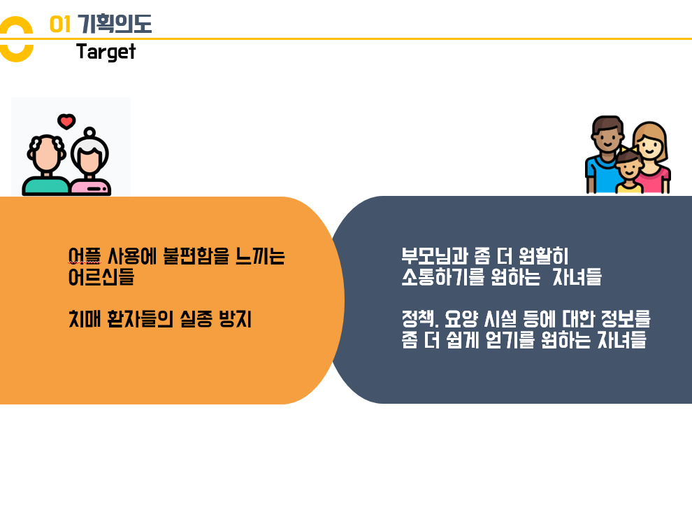

* 고령의 고객들이 기존의 분산된 기능을 좀 더 편하게 사용할 수 있도록 제작

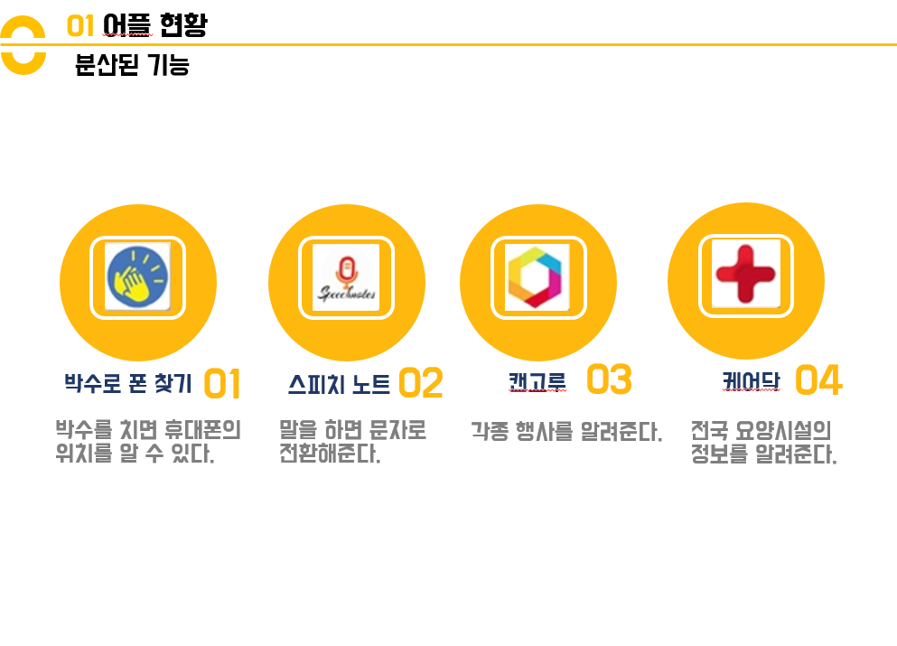

## 2. 시스템 아키텍처

* 시스템 아키텍처

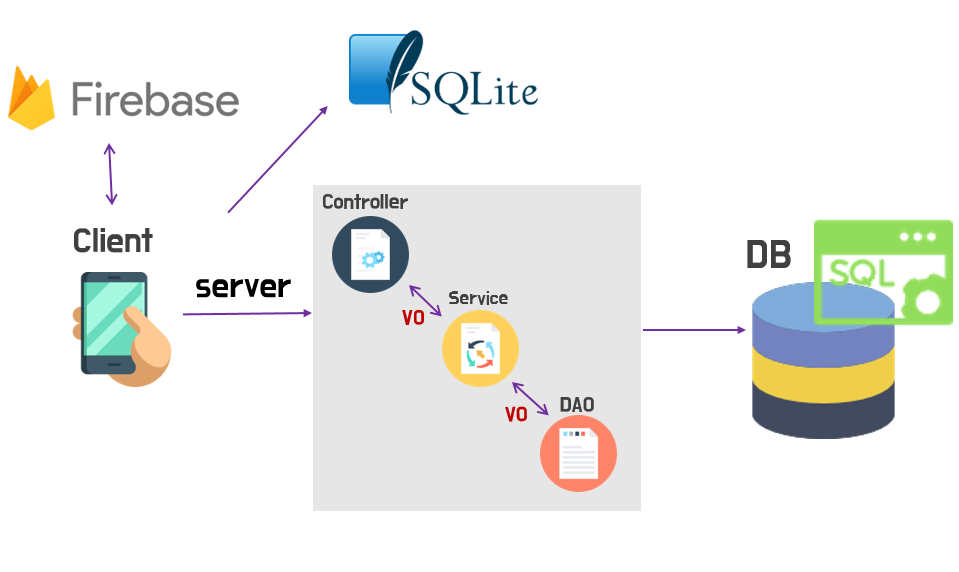

* 테이블 구조

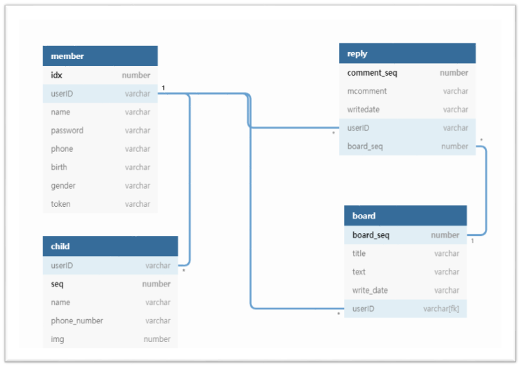

## 3. 기능 구현

* 부모님 단

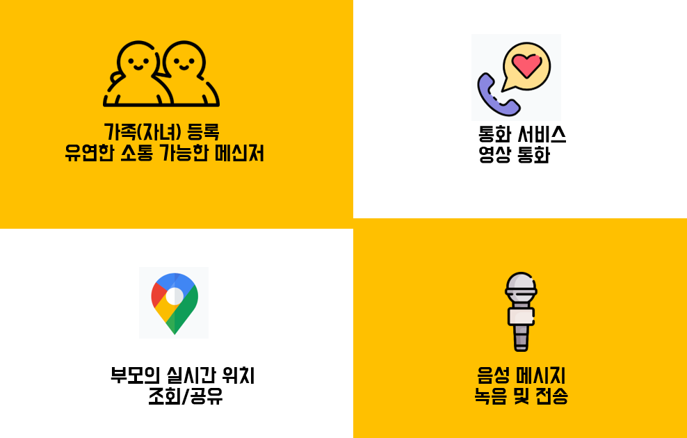

* 자녀 단

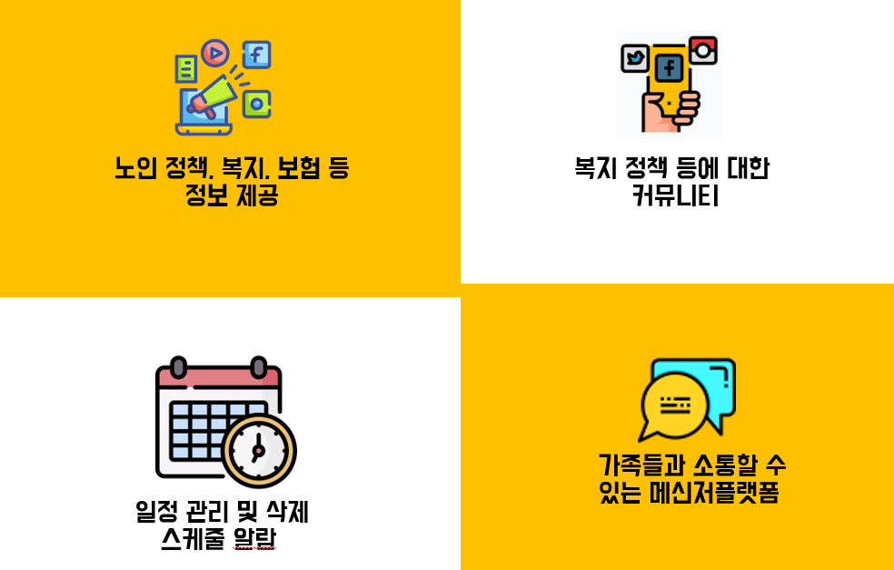

## 4. 나의 기여도

### 1) 채팅

1. 권한 부여

* 채팅 시 사진 전송을 하기위한 카메라 및 앨범에 접근하기 위한 권한 부여

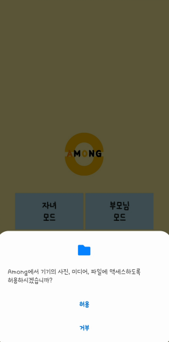

```xml
    <uses-permission android:name="android.permission.INTERNET" />
    <uses-permission android:name="android.permission.CAMERA" />
    <uses-permission android:name="android.permission.READ_EXTERNAL_STORAGE" />
    <uses-permission android:name="android.permission.WRITE_EXTERNAL_STORAGE" />
    <uses-permission android:name="android.permission.ACCESS_NETWORK_STATE" />
```

2. 구글 로그인 구현

>  구글 인증 기능을 이용하여 구글 API 이용한 로그인 기능 구현

* firebase 를 이용하여  user 관리
  *  로그인 후, Firebase의 realtime database의 user 객체에 사용자 정보insert

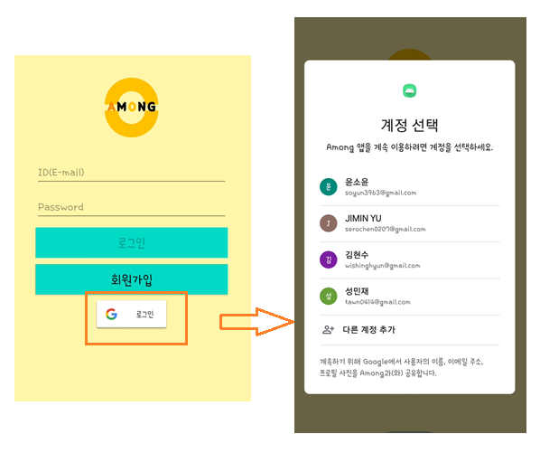

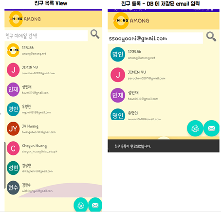

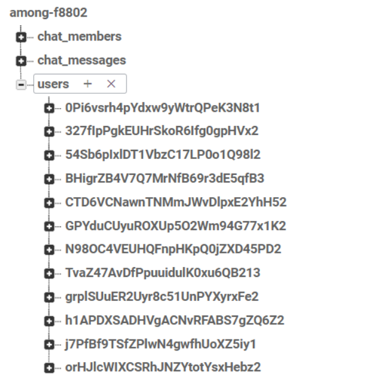

3. 친구 리스트 구현

* RecyclerView를 이용한 친구 목록 구현
* Checkbox를 이용한 다중 선택 가능
  
  * 하단의 floating 버튼을 이용해서 기능 숨김 가능
  
  * 친구 검색 , 다중 채팅을 위한 checkbox
  
    \-    친구 추가는 Firebase에 있는 USER만 가능

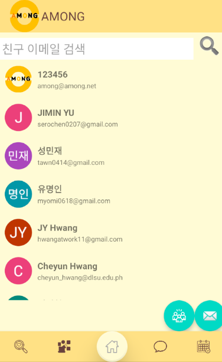

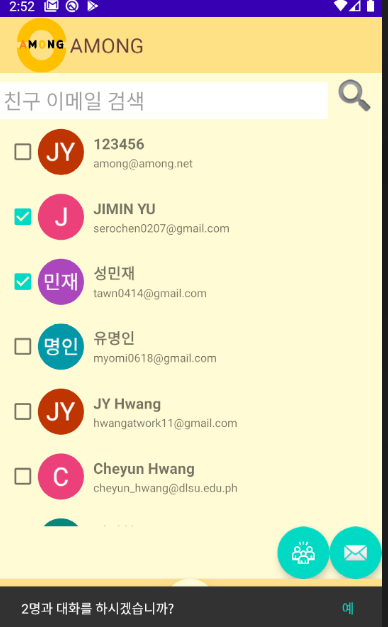

4. 채팅 화면

   * 1 : 1 채팅

     \-    메시지를 보내면 상대방에게 notification 도착

     \-    채팅 리스트에 읽지 않은 메시지 개수 표현


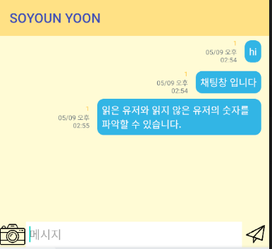

​					- 1:1 대화 시  채팅 방 이름은 대화 상대 로 바뀐다.

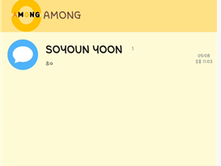

5. 다중채팅

   -  체크박스 선택 시 snackbar에 인원수 표시
   -  채팅 접속자 리스트 Toolbar에 구현

   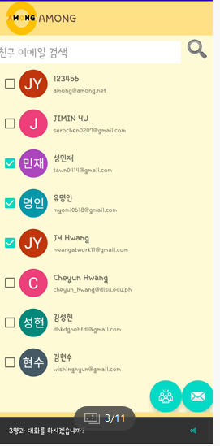

   * 사진 전송 
     - Storage를 이용한 파일 전송

   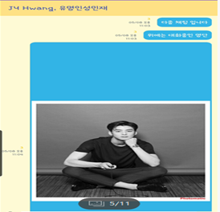

### 2) 일정 관리

1. 월별 달력

* 날짜 선택 시 Diaglog를 이용해 일정 추가 구현

  \-    SQLite를 이용한 일정 CRUD 구현

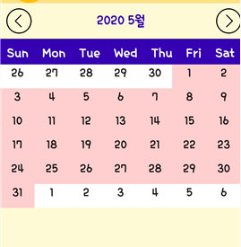

2. 일정 추가
   * 날짜 Click시 event 이름, 시간, 알람 설정을 선택할 수 있다.

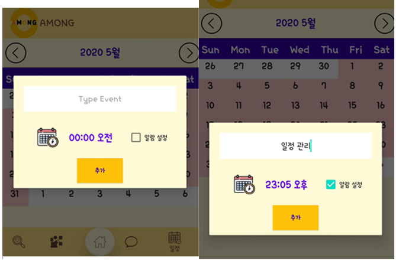

​			-  추가된 일정은 event 로 표시된다.

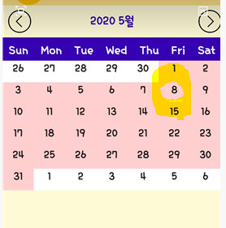

3. 일정 확인

* LongClick 시 추가된 일정 볼 수 있음

  \-    Alarm 버튼 누르면 알람 noti가 취소된다.

  \-    삭제 버튼 누르면 일정이 db에서 삭제된다.

  \-     알람 시간이 되면 NOTI 발생

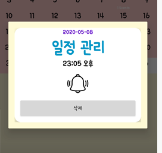

