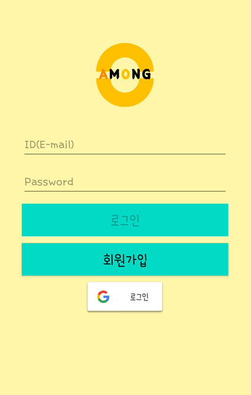
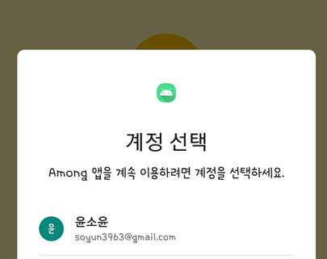

# AMONG(Android Project) 

## 1. 기획


* 고령의 고객들이 기존의 분산된 기능을 좀 더 편하게 사용할 수 있도록 제작


## 2. 시스템 아키텍처

* 시스템 아키텍처


* 테이블 구조


## 3. 기능 구현

* 부모님 단


* 자녀 단


## 4. 나의 기여도

### 1) 채팅


* 채팅 중 파일 전송을 위한 권한 부여


```xml
    <uses-permission android:name="android.permission.INTERNET" />
    <uses-permission android:name="android.permission.CAMERA" />
    <uses-permission android:name="android.permission.READ_EXTERNAL_STORAGE" />
    <uses-permission android:name="android.permission.WRITE_EXTERNAL_STORAGE" />
    <uses-permission android:name="android.permission.ACCESS_NETWORK_STATE" />
```

* 구글 인증 및 로그인 API 구현
  * firebase 를 이용하여  user 관리






* 친구 리스트 구현

  * RecyclerView를 이용한 친구 목록 구현
  * Checkbox를 이용한 다중 선택 가능
    * 왼쪽 버튼 클릭시 setVisible이 활성화되어 checkbox 생성 

  


* 채팅창


### 2) 일정 관리

 